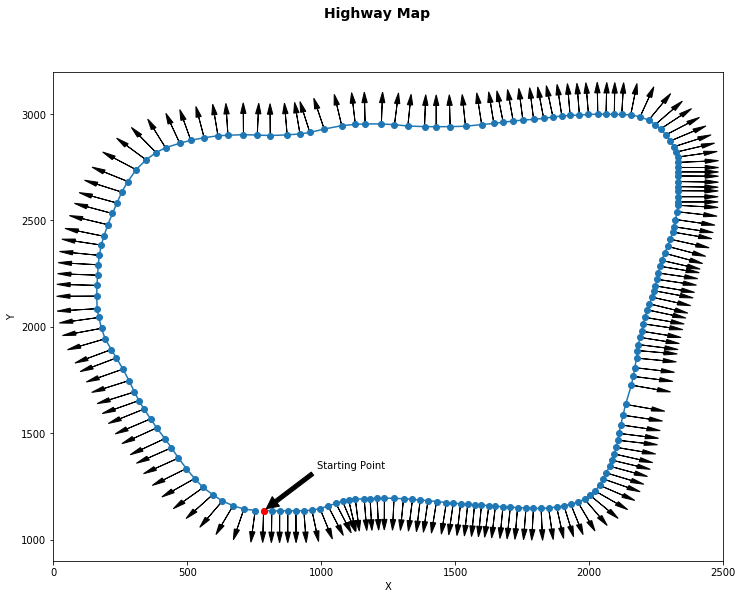

# CarND-Path-Planning-Project
## 1. Introduction

This project is to safely navigate a car around a virtual highway in the [simulator](https://github.com/udacity/self-driving-car-sim/releases) with other traffic that is driving +-10 MPH of the 50 MPH speed limit.

**Given** 

- Traffic car's localization and sensor fusion data
- A sparse map list of waypoints around the highway

**Requirement**

- The car should try to go as close as possible to the 50 MPH speed limit, which means passing slower traffic when possible, note that other cars will try to change lanes too. 
- The car should avoid hitting other cars at all cost as well as driving inside of the marked road lanes at all times, unless going from one lane to another. 
- The car should be able to make one complete loop around the 6946m highway. Since the car is trying to go 50 MPH, it should take a little over 5 minutes to complete 1 loop. 
- Also the car should not experience total acceleration over 10 m/s^2 and jerk that is greater than 50 m/s^3.

## 2. Highway Map Visualization

The map of the highway is in data/highway_map.txt

Each waypoint in the list contains  [x,y,s,dx,dy] values. 

- **x, y**: waypoint's map coordinate position.
- **s**: distance along the road to get to that waypoint in meters.
- **dx, dy**: values define the unit normal vector pointing outward of the highway loop.

The map is visualized as follows,




## 3. Data from the Simulator

Here is the data provided from the Simulator to the C++ Program

#### Main car's localization Data (No Noise)

- ["x"] The car's x position in map coordinates

- ["y"] The car's y position in map coordinates

- ["s"] The car's s position in frenet coordinates

- ["d"] The car's d position in frenet coordinates

- ["yaw"] The car's yaw angle in the map

- ["speed"] The car's speed in MPH


#### Previous path data given to the Planner

//Note: Return the previous list but with processed points removed, can be a nice tool to show how far along the path has processed since last time. 

- ["previous_path_x"] The previous list of x points previously given to the simulator

- ["previous_path_y"] The previous list of y points previously given to the simulator


#### Previous path's end s and d values 

- ["end_path_s"] The previous list's last point's frenet s value

- ["end_path_d"] The previous list's last point's frenet d value


#### Sensor Fusion Data, a list of all other car's attributes on the same side of the road. (No Noise)

["sensor_fusion"] A 2d vector of cars and then that car's 

0. car's unique ID, 
1. car's x position in map coordinates, 
2. car's y position in map coordinates, 
3. car's x velocity in m/s, 
4. car's y velocity in m/s, 
5. car's s position in frenet coordinates, 
6. car's d position in frenet coordinates.


## 4. Trajectory Generation Strategy

- 5 control points are used to fit a spline curve. Two of them are reused from previous path, the other 3 are located 30, 60 and 90 meters before the ego car along the frenet ***s*** direction.
- Then the generated spline curve are used to produce denser waypoints for the ego car to follow. Previous waypoints that the ego car haven't driven through are kept for use to make a smooth transition between different states.

## 5. Lane Changing Strategy

- If the ego car drives to a slower moving car in the same lane. It will slow down, check the traffic in its neighbor lanes and be ready for a lane changing. The logic used in my code is listed as follows:

  ```python
  if ego car is too close to front car:
      if lane is 1:
  		if left lane is clear:
  			lane -= 1
          elif right lane is clear:
              lane += 1
          else:
              keep lane and follow front car
      else if lane is 0:
          if right lane is clear:
              lane += 1
          else:
              keep lane and follow front car
      else: (lane is 2)
          if left lane is clear:
              lane -= 1
          else:
              keep lane and follow front car       
  ```

  ​

## 6. Result

Now the ego car is able to finish the whole lap following the generated trajectory, and smoothly implement a lane changing when it's needed.